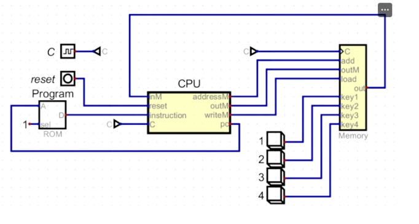

## Cómo interactúan cada uno de los componentes del computador que se simuló en el ejercicio

Este sistema simula un computador de 16 bits con una arquitectura básica.

- La ROM almacena el programa.
- La CPU ejecuta las instrucciones.
- La memoria maneja los datos.

La interacción del usuario a través de las teclas y la visualización en el HACK Display demuestran cómo los componentes trabajan juntos para procesar entradas y generar salidas.
Esta simulación es una buena forma de entender los fundamentos de la arquitectura de computadoras y cómo interactúan sus componentes principales.

